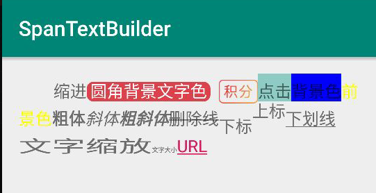

### 用法示例
```text
        CharSequence label = TextSpanBuilder.create("缩进")
                .leadingMargin(100, 0)
                .append("圆角背景文字色")
                .span(new RoundBgColorSpan(0xFFDD424D, 0xFFFFFFFF, 20))
                .append("\u0020\u0020")
                .append("居中对齐的图片")
                .span(new CenteredImageSpan(this, R.mipmap.ic_label_intergel))
                .append("点击")
                .span(new RedClickableSpan() {
                    @Override
                    public void onClick(@NonNull View widget) {
                        Toast.makeText(getApplicationContext(), "点击回调", Toast.LENGTH_SHORT).show();
                    }
                })
                .append("背景色")
                .backgroundColor(Color.BLUE)
                .append("前景色")
                .foregroundColor(0xFFFFFF00)
                .append("粗体")
                .bold()
                .append("斜体")
                .italic()
                .append("粗斜体")
                .boldItalic()
                .append("删除线")
                .strikeThrough()
                .append("下标")
                .subscript()
                .append("上标")
                .superscript()
                .append("下划线")
                .underline()
                .append("文字缩放")
                .xProportion(2F)
                .append("文字大小")
                .sizeInPx(18)
                .append("URL")
                .url("mailto:1032694760@qq.com?subject=test")
                .build();
        mTextMessage.setText(label);
```